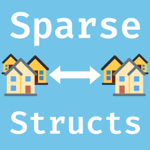
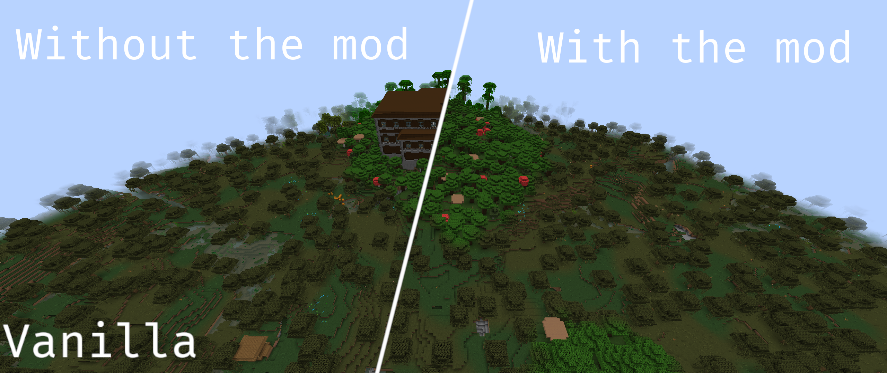
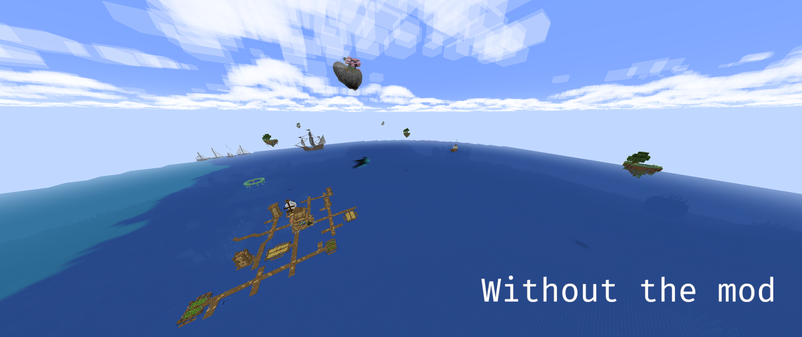

#  Sparse Structures
A simple and configurable one-mixin mod that makes all (even datapacks and modded) structures more spread out (or more common!), essentially making them rarer/easier to find. Useful in big modpacks with a lot of structures mod to encourage exploration and make the experience more challenging or balanced.

> Notice: this does not alter the generation of ores/geodes or other features of this kind, and alters very slightly the terrain and trees (not enough to be an issue to most players).

## Examples


### In a modded environment:


<details><summary>Structure Mods in the picture :</summary>
Tidal towns, Explorify, all Yung's mods, Just Another Structure Pack, MVS, Explorations, Towns and Towers, Dungeons and Taverns...
</details>

## Configuration
The config can be found in the `config` folder of your instance, and is named `sparsestructures.json5`. It contains the following options :
* `spreadFactor` : the factor by which the separation and spacing of structures should be multiplied. The default value is `2`, which means that structures will be twice as rare. If you want structures to be more common, you can set this value to `0.5` for example.
* `customSpreadFactors` : a list of custom spread factors for specific structures. The default value makes the mansion twice as rare as an example (which has no effects with a global `spreadFactor` of 2). If you want to change the spread factor of a structure, you can add an entry to this list. Each entry is a JSON object with two fields : `name` (the name of the structure) and `spreadFactor` (the spread factor of the structure). Here's an example :
```json5
{
    "name": "minecraft:mansion",
    "spreadFactor": 2
}
// More detailed info can be found inside the config file
```

## Dependencies
This mod doesn't have any (not even fabric-api).

## Future Updates
* *Open an issue on this project's repo if you have any suggestion!*
* *~~Add an option to blacklist mods/structures.~~*
* *~~Add an option to change the spread factor.~~*

## How it worked for version 1.x of the mod (it's similar for 2.x but you can see the code on GitHub)

Minecraft world generation for structures uses two parameters (among others) that tells how structure should be spread out in the world : `separation` and `spacing`. Separation tells what should be the minimum distance between two of the same structures, and spacing tells what should be the maximum distance. All this mod does is double those values when a structure is initialized.

Here's all this mod's code :
```java
@Mixin(RandomSpreadStructurePlacement.class)
public class SparseStructures {
    @Mutable @Shadow @Final private int separation;
    @Mutable @Shadow @Final private int spacing;

    @Inject(at = @At("TAIL"), method = "<init>(Lnet/minecraft/util/math/Vec3i;Lnet/minecraft/world/gen/chunk/placement/StructurePlacement$FrequencyReductionMethod;FILjava/util/Optional;IILnet/minecraft/world/gen/chunk/placement/SpreadType;)V")
    public void RandomSpreadStructurePlacement(Vec3i locateOffset, StructurePlacement.FrequencyReductionMethod frequencyReductionMethod, float frequency, int salt, Optional exclusionZone, int spacing, int separation, SpreadType spreadType, CallbackInfo ci) {
        this.separation *= 2;
        this.spacing *= 2;
    }
}
```

## Credits
Icon made with [Gimp](https://www.gimp.org/) using [Twemoji](https://github.com/twitter/twemoji) and [FiraCode](https://github.com/tonsky/FiraCode)
