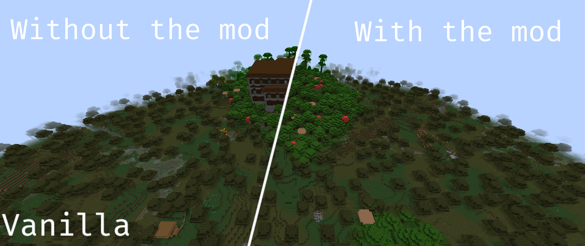
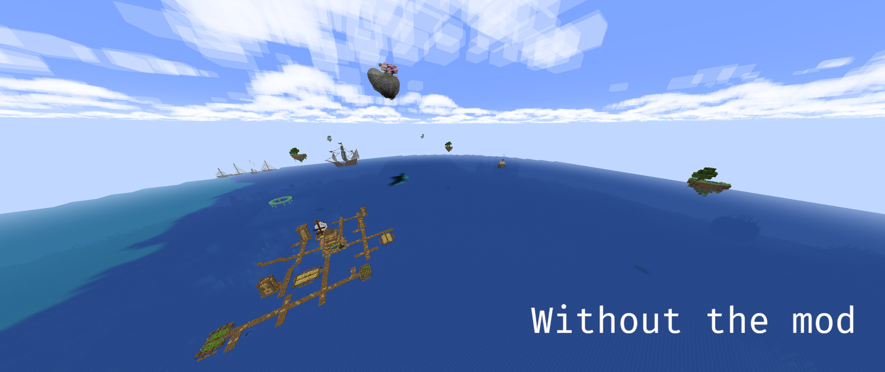

# Sparse Structures
A simple and configurable mod that makes all (even datapacks and modded) structures more spread out (or more common!), essentially making them rarer/easier to find. Useful in big modpacks with a lot of structures mod to encourage exploration and make the experience more challenging or balanced.

> Notice: this does not alter the generation of ores/geodes or other features of this kind, and alters very slightly the terrain and trees (not enough to be an issue to most players).

## 💗 Sponsor
[](https://www.bisecthosting.com/MAX)

## ⁉️ Support

Questions about the mod? You can join my new Discord server at [discord.gg/cTY4ME6Bkn](https://discord.gg/cTY4ME6Bkn)!

## 🖼️ Examples


### In a modded environment:


<details><summary>Structure Mods in the picture :</summary>
Tidal towns, Explorify, all Yung's mods, Just Another Structure Pack, MVS, Explorations, Towns and Towers, Dungeons and Taverns...
</details>

## 🤓 Features
* **Configurable** : you can change the rarity of all individual structures, even from mods and datapacks.
* **MC-177381 fix** : fixes the bug where `/locate` returns an incorrect distance between the player and the structure.
* **Dump Structure Sets** : you can dump all structure sets to a file in the right format for the config using `/dumpstructuresets`.
* **No separation limit** : in vanilla, the separation between structures is limited to 4096 chunks (65k blocks). This mod removes this limit, allowing structures to be even more spread out (if for any reason you need structures to be that rare).
* **Disabling structures** : you can disable structures by setting their spread factor to `0`.
* **Improved structure spread** : by using a custom salt based on the structure ID, this mod avoids structure clustering. This is especially useful for mods that leave the salt to `0` or some other default value used across a lot of structures.

## 🛠️ Configuration
The config can be found in the `config` folder of your instance, and is named `sparsestructures.json5`. It contains the following options :
* `spreadFactor` : the factor by which the separation and spacing of structures should be multiplied. The default value is `2`, which means that structures will be twice as rare. If you want structures to be more common, you can set this value to `0.5` for example.  
You can disable structures with a factor of `0`.
    * ⚠️ **Warning** : a very low value (like `0.01`) makes the world generation process considerably slower.
* `idBasedSalt` : a boolean that indicates whether the salt used to generate all structures should be based on the structure ID. This is meant to avoid structure clustering as some mods leave the salt to 0. The default value is `true`.
* `customSpreadFactors` : a list of custom spread factors for specific structures. The default value makes the mansion twice as rare as an example (which has no effects with a global `spreadFactor` of 2). If you want to change the spread factor of a structure, you can add an entry to this list. Each entry is a JSON object with two fields : `name` (the name of the structure) and `spreadFactor` (the spread factor of the structure). Here's an example :
```json5
{
    "name": "minecraft:mansion",
    "spreadFactor": 2
}
// More detailed info can be found inside the config file
```
> Tip: you can dump all structure sets to a file in the right format by using the custom command `/dumpstructuresets`

For now (v2.0), you have to restart the game for the config to be reloaded. This behavior may change in the future.

## 📜 Dependencies
Fabric API (if you're using Fabric, or use the Quilt equivalent)

## ⏱️ Future Updates
* World-specific configs
* Support for structure tags in the config
* Ability to customize biome constraints for structures
* *Open an issue on this project's repo if you have any suggestion!*
* *~~Add a config~~* (added in v2.0)
* *~~Ban specific structures from generating~~* (added in v3.0)
* *~~Support for frequency-based structure generation~~* (added in v3.0)

## ©️ Credits
Icon made with [Gimp](https://www.gimp.org/) using [Twemoji](https://github.com/twitter/twemoji) and [FiraCode](https://github.com/tonsky/FiraCode)
[Multiloader Template](https://github.com/jaredlll08/MultiLoader-Template) by jaredlll08
