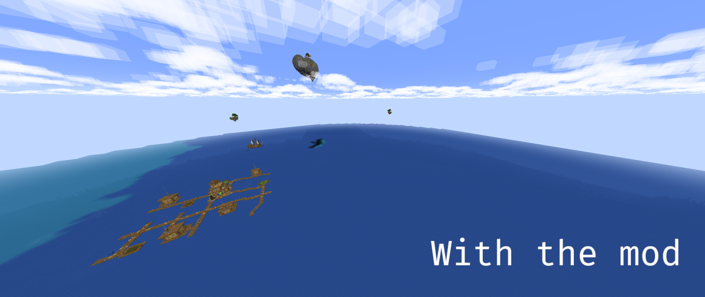

#  Sparse Structures
A simple one mixin mod that makes all (even datapacks and modded) structures more spread out, essentially making them rarer to find. Useful in big modpacks with a lot of structures mod to encourage exploration and make the experience more challenging.

> Notice: this does not alter the generation of ores/geodes or other features of this kind, and alters very slightly the terrain and trees (not enough to be an issue to most players).

## Examples


### In a modded environment:


<details><summary>Structure Mods in the picture :</summary>
Tidal towns, Explorify, all Yung's mods, Just Another Structure Pack, MVS, Explorations, Towns and Towers, Dungeons and Taverns...
</details>

## Dependencies
This mod doesn't have any (not even fabric-api).

## Future Updates
* Add an option to change the spread factor.
* Add an option to blacklist mods/structures.
* *Open an issue on this project's repo if you have any suggestion!*

## How it works
Minecraft world generation for structures uses two parameters (among others) that tells how structure should be spread out in the world : `separation` and `spacing`. Separation tells what should be the minimum distance between two of the same structures, and spacing tells what should be the maximum distance. All this mod does is double those values when a structure is initialized.

Here's all this mod's code :
```java
@Mixin(RandomSpreadStructurePlacement.class)
public class SparseStructures {
    @Mutable @Shadow @Final private int separation;
    @Mutable @Shadow @Final private int spacing;

    @Inject(at = @At("TAIL"), method = "<init>(Lnet/minecraft/util/math/Vec3i;Lnet/minecraft/world/gen/chunk/placement/StructurePlacement$FrequencyReductionMethod;FILjava/util/Optional;IILnet/minecraft/world/gen/chunk/placement/SpreadType;)V")
    public void RandomSpreadStructurePlacement(Vec3i locateOffset, StructurePlacement.FrequencyReductionMethod frequencyReductionMethod, float frequency, int salt, Optional exclusionZone, int spacing, int separation, SpreadType spreadType, CallbackInfo ci) {
        this.separation *= 2;
        this.spacing *= 2;
    }
}
```

## Credits
Icon made with [Gimp](https://www.gimp.org/) using [Twemoji](https://github.com/twitter/twemoji) and [FiraCode](https://github.com/tonsky/FiraCode)
